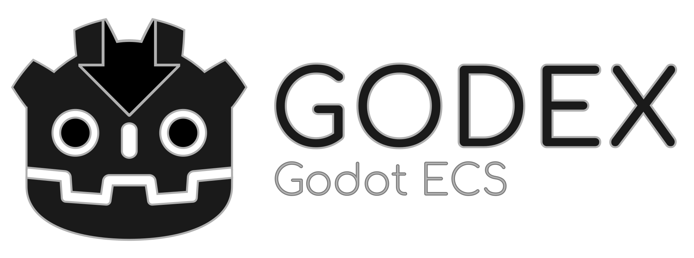

# Godex

    

Godex is a Godot Engine ecs library.

**Disclaimer:** this module is still in development, open an [issues](https://github.com/GodotECS/godex/issues) to report any problem or a new [discussion](https://github.com/GodotECS/godex/discussions) if you need any help. Any form of contribution is welcome.

### The tested Godot version
Is `master` `92bee43adba8d2401ef40e2480e53087bcb1eaf1`, please open an issue if the current master is not working or doesn't compile.

### What is ECS
Shortened as ECS, the Entity Component System is an architectural design pattern that allow to organize the data in a way so that the workload can be split into small and easy programs.

### Wiki
The [wiki](https://github.com/GodotECS/godex/wiki/) is available; useful links:
- [Glossary](https://github.com/GodotECS/godex/wiki/Glossary)
- [Setup](https://github.com/GodotECS/godex/wiki/Setup).
- [Create a new Godex project](https://github.com/GodotECS/godex/wiki/Create-a-new-Godex-Project)

### Examples
You can find some example projects [here: GodotECS/godex-examples](https://github.com/GodotECS/godex-examples). The [Unit tests](https://github.com/GodotECS/godex/tree/main/tests) are also a good resource to see how specific things works.

### Community
If you want to chat about Godex, you can join the community on [Discord](https://discord.gg/EFmWpf869q).

### Contributing
Open an issue to give a feedback, propose a new feature, or signal a bug is really welcome and will help this project grow!
If you want to help with coding instead, those two links may turn useful:
- [Junior Job](https://github.com/GodotECS/godex/issues?q=is%3Aissue+is%3Aopen+label%3A%22Junior+Job%22)
- [Hero Wanted!](https://github.com/GodotECS/godex/issues?q=is%3Aissue+is%3Aopen+label%3A%22hero+wanted%21%22)

### Executable download
You can download [Linux](https://github.com/GodotECS/godex/actions/workflows/linux_builds.yml) and [Windows](https://github.com/GodotECS/godex/actions/workflows/windows_builds.yml) executable from [GitHub Actions](https://github.com/GodotECS/godex/actions):

# Contributors

Made with [contrib.rocks](https://contrib.rocks).
